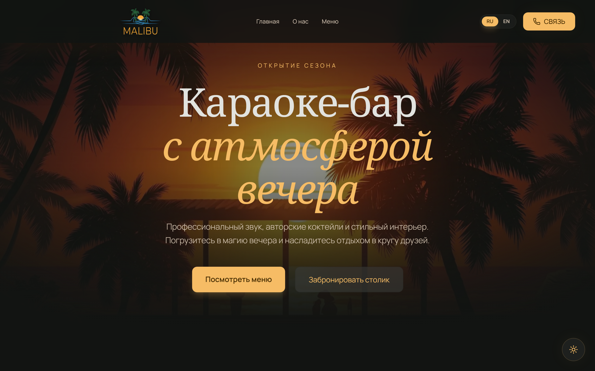
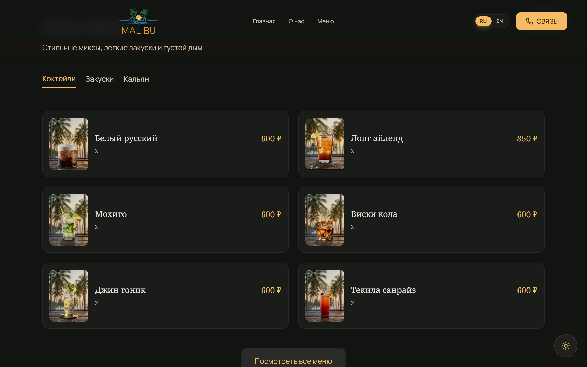
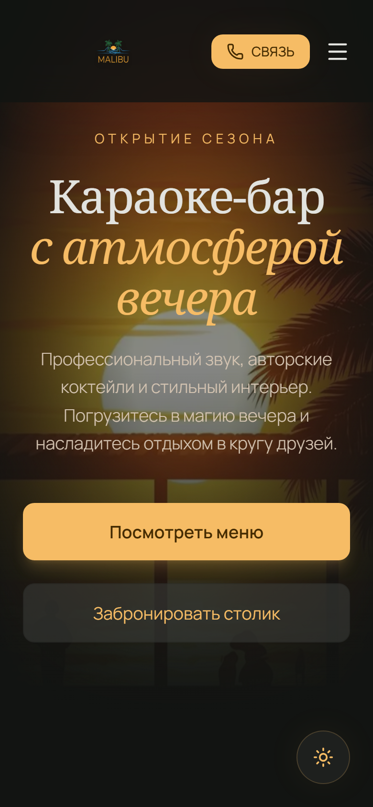

# 🍹 Malibu — Karaoke & Lounge Bar Landing Page

<p align="center">
  
  
  
  
  
  
</p>

---

## 📸 Preview & Screenshots

### 🖥 Desktop View


### 🍸 Interactive Cocktail & Lounge Menu


### 📱 Mobile View
<p align="center">
  
</p>

---

## 🌴 About The Project

A sleek, modern landing page designed for **Malibu Karaoke & Lounge Bar**, built with a **"Midnight Oasis"** design philosophy. The interface embodies the relaxed, upscale ambiance of a tropical evening — deep charcoal tones, ambient amber gold accents, delicate glassmorphism, and smooth micro-interactions.

### ✨ Key Features

* **🎨 "Midnight Oasis" Visual Identity:** Organic luxury aesthetic combining warm lighting, deep contrast, and refined typography (*Noto Serif* & *Manrope*).
* **🌐 Bilingual Support:** Instant client-side switching between **Russian** and **English** with smooth transitions.
* **🍹 Dynamic Menu Showcase:** Categorized cocktail cards, bar snacks, and hookah items with pricing and responsive image grids.
* **📱 100% Responsive:** Optimized layout crafted for mobile devices, tablets, and wide desktop displays.
* **⚡ High-Speed Performance:** Pre-configured with modern tooling (Vite + React 19 + Tailwind CSS 4).

---

## 🛠 Tech Stack

* **Framework:** [React 19](https://react.dev/)
* **Build Tool:** [Vite 6](https://vitejs.dev/)
* **Styling:** [Tailwind CSS v4](https://tailwindcss.com/)
* **Animations:** [Motion (Framer Motion 12)](https://motion.dev/)
* **Icons:** [Lucide React](https://lucide.dev/)
* **Language:** [TypeScript](https://www.typescriptlang.org/)

---

## 🚀 Quickstart

### 1. Clone the repository
```bash
git clone https://github.com/uahadov/malibu.git
cd malibu
```

### 2. Install dependencies
```bash
npm install
```

### 3. Run development server
```bash
npm run dev
```
Open [http://localhost:3000](http://localhost:3000) in your browser.

### 4. Build for production
```bash
npm run build
```
The optimized static build will be generated in the `dist/` directory.

---

## 📁 Project Structure

```text
├── dist/                   # Production build outputs & assets
├── docs/
│   └── screenshots/        # High-resolution UI screenshots
├── public/                 # Static images, logos & backgrounds
├── src/
│   ├── App.tsx             # Main landing page components & layout
│   ├── index.css           # Tailwind CSS imports & theme definitions
│   ├── main.tsx            # React application entry point
│   └── translations.ts     # Multi-language dictionary (RU / EN)
├── DESIGN.md               # Design system & visual guidelines
├── package.json            # Project dependencies & scripts
└── vite.config.ts          # Vite configuration
```

---

## 📄 License

This project is open-source and available under the [MIT License](LICENSE).
